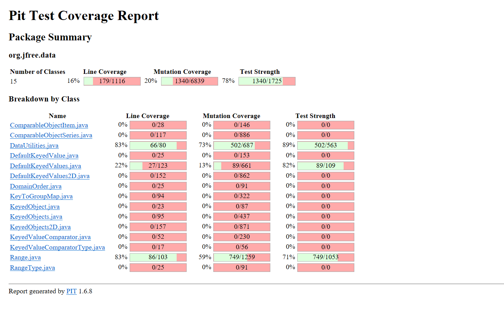

**SENG 438 - Software Testing, Reliability, and Quality**

**Lab. Report \#4 – Mutation Testing and Web app testing**

| Group \#: 22         |     |
| --------------       | --- |
| Student Names:       |     |
| Kamand Ghorbanzadeh  |     |
| Isabelle Gaudet      |     |
| Spiro Douvis         |     |
| Dylan Wenaas         |     |

# Introduction
In this lab, we explored Mutation and GUI testing using automation tools like PiTest and Selenium. We conducted mutation testing on the JFreeChart SUT from previous labs and added new test cases to improve the mutation test scores. Additionally, we performed GUI testing on popular e-commerce websites such as Amazon and wrote test scripts using Selenium.

# Analysis of 10 Mutants of the Range class 
1) **Method:** `double getCentralValue()`
    - Mutation replaced double addition with division --> **Killed**

2) **Method:** `double.getLength()`
    - Mutation negated double field `lower` --> **Killed**

3) **Method:** `boolean contains(double value)`
   - Mutation subsututed `1` with a `-1` --> **Survived** 

4) **Method:** `Range combineIgnoringNaN(Range range1, Range range2)`
    - Mutation removed conditional and replaced the equality check with `false` --> **Survived**

5) **Method:** `scale(Range base, double factor)`
    - Mutation changed the conditional boundary --> **Killed** 

6) **Method:** `toString()`
    - Mutation replaced call to `java/lang/StringBuilder::append` --> **Killed** 

7) **Method:** `expandToInclude()`
    - Mutation replaced the `!=` (not equal) operator with `==` (equal) --> **Killed** 

8) **Method:** `isNaNRange()`
    - Mutation substitied the `1` with `0` --> **Killed**

9) **Method:** `double min(double value1, double vaule2)`
    - Mutation replaced a double return with a `0.0f` --> **Survived**

10) **Method:** `double max(double value1, double value2)`
    - Mutation removed a conditioanl and replaced the equality check with `true` --> **Survived** 

# Report all the statistics and the mutation score for each test class
Mutation Scores from Assignment 03:

Mutation Scores from Assignment 04:

# Analysis drawn on the effectiveness of each of the test classes
**Range Class Tests:**
Reviewing the effectiveness of our mutation coverage on the `RangeTest` class, we noticed several key insights. Initially, our mutation coverage was only **59%**, which was surprising given our previously high coverage in Assignment 3. After reviewing the summary log, we found that some areas of the code were not being tested as thoroughly as anticipated.

The log showed that many mutants were surviving, often affecting the same lines of code. To address this, we wrote new test cases to target multiple surviving mutants within a single test. Key areas where many mutants survived included the `intersect()`, `expand()`, and `combineIgnoringNaN()` methods. We created detailed and specific test cases to target these methods, ultimately increasing our mutation coverage by **18%**. However, it should be noted that equivalent mutants negatively impact mutation score accuracy, which we discuss below. 

**DataUtilities Class Tests:**
Initially, our mutation coverage for `DataUtilitiesTest` was **73%**. Upon reviewing the summary log, we found that several sections of the code had many surviving mutants. Since we had previously removed failing test cases, we decided to create new test cases based on the summary log, specifically for the `calculateRowTotal()`, `calculateColumnTotal()`, and `equal()` methods. By adding these new test cases, we increased mutation coverage to **92%**. However, as with the `RangeTest` class, equivalent mutants negatively impact mutation score accuracy.

# A discussion on the effect of equivalent mutants on mutation score accuracy
Equivalent mutants negatively impact mutation score accuracy. In this lab, we calculated mutation score as:

Mutation Score = Total Mutants Killed / All Mutants

However, in an ideal scenario, equivalent mutants should be excluded from this calculation:

Ideal Mutation Score = Total Mutants Killed / All Non-Equivalent Mutants 

Equivalent mutants behave identically to the original program, meaning they do not introduce real faults. These mutants cannot be killed, as they do not represent genuine program bugs. Including them in the mutation score calculation artificially lowers the score and misrepresents the effectiveness of the test suite. Detecting equivalent mutants is a challenging and often undecidable problem, usually requiring manual review of survived mutants.

# A discussion of what could have been done to improve the mutation score of the test suites
Reflecting on our experience with PiTest and mutation testing, we recognize opportunities for further improvement. While we increased our mutation coverage significantly, we could have pushed our `RangeTest` class closer to **90%**.

To further improve mutation coverage, we would:

- Ensure our test suite covers all types of mutants.
- Target multiple mutants affecting the same lines of code, maximizing efficiency by writing fewer but more comprehensive tests.
- Continue analyzing the summary log to identify areas with high mutant survival rates.

For example, our `RangeTest` suites contains over 100 unit tests and has **77**% mutation coverage. To improve this further, we need to create highly specific tests, directly addressing surviving mutants from the summary log.

# Why do we need mutation testing? Advantages and disadvantages of mutation testing
Mutation testing is essential because traditional coverage metrics alone do not guarantee the quality of test suites. A high coverage percentage does not necessarily mean that all potential bugs are caught—it could also mean that tests are poorly designed. Mutation testing helps determine whether test cases effectively detect faults.

**Advantages of Mutation Testing:**
- Ensures a stable and reliable product.
- Achieves high coverage of the source program.
- Tests program mutants thoroughly.
- Significantly improves testing quality.
- Identifies weaknesses and loopholes in test data.

**Disadvantages of Mutation Testing:**
- Complex mutations can be difficult to implement.
- Mutation testing is time-consuming and expensive.
- Automation is necessary due to its time-consuming nature.
- Testers must have programming knowledge to perform mutation testing.
- Not applicable to black-box testing, as it requires access to source code.
- Large mutant programs require extensive testing against the original test suite.

**Source:** [Mutation Testing Advantages and Disadvantages](https://www.softwaretestingclass.com/mutation-testing-advantages-and-disadvantages/)

# Explain your SELENUIM test case design process

Our Selenium test case design process involved automating two distinct functionalities per team member for the selected application under test. The functionalities were chosen to cover key user interactions and sequences of events on the website and each group member had 2 functionalities with a related task (eg logging into and logging out of the system - seperate functionalities with high relation). Each larger functionality was broken down into 2 unique functionalities, and then further broken down into seperate test cases with different test data, ensuring that all possible scenarios were covered for a total of 8 functionalities. We selected the Home Depot page. Below is the breakdown of the 8 functionalities:

1. **Search Functionality**:
   - **Functionality 1**: Searching for a product and verifying that the search results page loads correctly.
   - **Functionality 2**: Filtering the search results using 'Filter by' functionality and making a selection and verifying that the filtered results are displayed.

2. **Cart Functionality**:
   - **Functionality 3**: Adding items to the cart and verifying that the product is correctly added to the cart/ the total price is calculated correctly.
   - **Functionality 4**: Clearing the cart and verifying that it is empty.

3. **Create Account and Login Functionality**:
   - **Functionality 5**: Logging in with valid credentials and verifying that the user is redirected to their account page.
   - **Functionality 6**: Logging out and verifying that the user is redirected to the homepage.

4. **Navigation Functionality**:
   - **Functionality 7**: Navigating between sections forward and verifying that the correct page is loaded.
   - **Functionality 8**: Navigating between sections backwards and verifying that the correct page is returned to.

The test cases were automated using Selenium IDE, a record-and-playback tool, to simplify the process of creating and executing test scripts. When necessary we meeded to use the browser's developer tools to inspect elements and ensure accurate locators for interacting with the application's components. Each test case included assertions and checkpoints to validate the expected outcomes, such as verifying page titles, element visibility, and error messages. This approach allowed for efficient test creation while ensuring the reliability of the automated tests.

# Explain the use of assertions and checkpoints

Assertions and checkpoints were essential in validating the outcomes of our automated tests and ensuring that the application behaved as expected at each step. Below is how they were applied in the context of the functionalities we tested:

1. **Assertions**

Assertions were used to compare expected and actual values to confirm that specific conditions were met. Some of the assertions we used and how we used them:

  - `assert text`: Used to verify that the name of an item added to the cart matched the name displayed in the cart. Ensured that the total price in the cart was calculated correctly after adding multiple items.
  - `assert title`: Used to confirm that the correct page was loaded after specific actions, such as logging in or navigating between sections.
  - `assertElementPresent`: Used to verify the presence of critical elements, such as the "View Cart" button or error messages for invalid login attempts.

2. **Checkpoints**

Checkpoints were used to validate intermediate steps in workflows, ensuring that the application behaved as expected at key points. Some of the checkpoints used and how we used them:

  - `Search Functionality`: Verifying that the search results page loaded correctly after entering a query. Ensuring that applying filters to search results displayed the correct filtered items.
  - `Cart Functionality`: Confirming that the cart updated correctly after adding or removing items. Verifying that the cart displayed the correct total price after adding multiple items.
  - `Login/Logout Functionality`: Checking that the user was redirected to their account page after logging in with valid credentials. Ensuring that the user was redirected to the homepage after logging out.
  - `Navigation Functionality`: Verifying that forward navigation led to the correct sections of the website. Ensuring that backward navigation returned the user to the correct previous pages.

By incorporating assertions and checkpoints at critical points in the test cases, we were able to detect deviations from expected behavior early in the workflow, validate that the application handled edge cases (eg. invalid login credentials, empty cart) correctly and thus ensure that the user experience was consistent and reliable across different functionalities.

# how did you test each functionaity with different test data

Each functionality was tested with a variety of data sets to ensure robustness and reliability. Below is how different test data was applied for each functionality. Note, some functionalities required 2/3 tests to fully test, and some only required 1 as there is only 1 case in which that functionality would be realistically presented and exercised.

1. **Search Functionality**:
Functionality 1:
   - `Search with Valid Input`: Tested with valid inputs (eg. "fridge") to verify that relevant results are displayed.
   - `Search with Invalid Input`: Tested with invalid inputs (eg. "xyz123") to verify that an appropriate "No results found" or similar message is displayed.
Functionality 2:
   - `Search with Single Filter`: Tested with applying one filter to search results to verify results are correctly limited.
   - `Search with Multiple Filters`: Testing with applying multiple filters to search results to verify results are correctly limited.

2. **Cart Functionality**:
Environment Setup: These tests must be performed on an empty cart. The test environment requires the cart is initially empty so that the system can correctly verify the text inside the cart is correct.
Functionality 3:
   - `Add Single Item to Cart`: Tested by adding a single item and verifying the cart contents.
   - `Add Multiple Items to Cart`: Tested by adding multiple items and verifying the total price calculation.
Functionality 4:
   - `Add and Remove Single Item from Cart`: Tested by adding and then removing an item and ensuring the cart updates correctly.

3. **Login Functionality**:
Environment Setup: These test cases use test cases: `Create Account 1` and `Create Account 2`. The order in which these are run respective to one another matter. Logging out of an account may also be required to run these. These tests will not be able to perform correctly through Selenium if an account is already logged into the site.
Functionality 5:
   - `Log In With Valid Credentials`: Tested with valid credentials to verify successful login and redirection to the account page.
   - `Log In With Invalid Credentials`: Tested with invalid credentials to verify that an error message is displayed.
   - `Log In With Error Credentials`: Tested with edge case fields (single digits, invalid email) to ensure appropriate error messages are shown.
Functionality 6:
   - `Log In With Valid Credentials and Log out`: Tested log out from valid log in.

4. **Navigation Functionality**:
Functionality 7:
   - `Navigation - Forward Only`: Tested by navigating to valid sections and verifying that the correct page loads.
Functionality 8:
   - `Navigation - Backwards and Over Multiple Pages`: Tested by navigating backwards (using back arrow) to verify that the correct page is returned to.
   - `Navigation - Backwards and Over Multiple Pages`: Tested by opening pages in a repeated manner and navigating backwards over multiple pages to verify pages are returned to in the order they were opened.
   
By using a combination of valid, invalid, and edge-case data to test each functionality, we ensured comprehensive testing of the application. Redundant testing was avoided where unnecessary. For example, in Functionality 4, creating additional tests to add and remove multiple items would have been redundant, as the behavior is effectively the same as adding and removing a single item. Similarly, for Functionality 6, only one test case was required, as there is only one scenario in which a user can log out of an account—after successfully logging in with valid credentials, as goes for Functionality 7 and 8. This approach allowed us to focus on meaningful test cases while avoiding duplication, ensuring efficiency and thoroughness in our testing process.

# Discuss advantages and disadvantages of Selenium vs. Sikulix

### Advantages of Selenium 
1. **Cross-Browser Support**: Selenium supports multiple browsers like Chrome, Firefox, Edge, and Safari.
2. **Programming Language Support**: Allows writing test scripts in various languages such as Java, Python, C#, and JavaScript (for this lab we used the IDE only), but also allows to export in multiple languages straight from simple statements.
3. **Dynamic Web Testing**: Handles dynamic web elements and asynchronous content effectively.
4. **Integration with CI/CD**: Easily integrates with CI/CD pipelines for automated testing.
5. **Community Support**: Selenium has a large community and extensive documentation.
6. **Pretty Intuitive**: Easy to set up and use, especially for non-programmers. Selenium IDE simply is a download in your browser and most operations are pretty easy to understand.
7. **Can write tests without programming**: Selenium IDE eliminates the need for programming, which is helpful for testers who may not have a strong coding background.

### Disadvantages of Selenium
1. **Steep Learning Curve**: Requires programming knowledge and familiarity with web technologies - we needed to use inspect frequently to more accuractely access some elements.
2. **No Built-in Reporting**: Needs third-party tools for reporting test results. Provides simple pass/fail.
3. **Limited Desktop Application Testing**: Selenium is designed for web applications only.
4. **Maintenance Overhead**: Test scripts can break if the web application changes frequently.
5. **No autosave**: Must explicitly save the tests as a new file each time youd like to update saved tests.

### Advantages of Sikulix
1. **Image-Based Testing**: Sikulix uses image recognition, making it ideal for testing applications without access to the source code.
2. **Simple to Use**: Easy to set up and use, especially for non-programmers.
3. **Cross-Platform**: Works on Windows, macOS, and Linux.
4. **Desktop Application Testing**: Can test desktop applications and GUI elements.

### Disadvantages of Sikulix
1. **Performance Issues**: Image recognition can be slow and resource-intensive.
2. **Fragile Tests**: Tests can fail if the UI appearance changes (e.g., color, size, or position).
3. **Limited Web Testing**: Not as robust as Selenium for web application testing.
4. **No Built-in CI/CD Integration**: Requires additional effort to integrate with CI/CD pipelines.

# How the team work/effort was divided and managed

The team divided the work based on the functionalities being tested, with each member responsible for specific areas of the application. 
Each team member automated 2 different functionalities of the application under test. Some functionalities required multiple tests for different possible scenarios and test data, and some functionalities were effctively tested with only one test.

Isabelle: Managed the Login and Logout Functionality, ensuring successful login/logout and proper redirection.
Kamand: Focused on the Search Functionality, including verifying search results and applying filters.
Spiro: Worked on the Navigation Functionality, ensuring forward and backward navigation between sections worked as expected.
Dylan: Handled the Cart Functionality, including adding items to the cart, verifying totals, and clearing the cart.

Each member automated their assigned functionalities using Selenium IDE, ensuring that test cases were comprehensive and covered edge cases as needed. Regular team meetings were held to review progress, discuss challenges, and ensure consistency across test cases. 

# Difficulties encountered, challenges overcome, and lessons learned

Selenium:

-Dynamic Locators in Selenium: Selenium often accessed elements by unique instance IDs, which caused tests to fail when rerun. To address this, we switched to more robust locators, such as CSS selectors or XPath expressions, to ensure the tests could run consistently.
-Login Functionality Issues: The login functionality occasionally stopped working after a few runs. This was resolved by waiting for the system to allow usage again but did result in delays for login functionality scripts to be tested and devloped.
-Test Dependencies: Some tests required other tests to be run beforehand or specific conditions to be met in the live environment. For example account creation was required before testing login functionality, login needed to be completed before testing logout functionality, the cart had to be emptied before testing cart-related functionalities. To manage this, we carefully sequenced the tests and ensured the environment was reset between test runs or added required functionalities to the same tests (ie. login and logout) so that they were always run in order.
-Selenium Not Autosaving: Selenium IDE does not have an autosave feature, which led to occasional loss of work. To mitigate this, we made it a habit to manually save the project frequently as a .side file.

# Comments/feedback on the lab itself
A few comments on the lab: we found it to be quite interesting and introduced us to new concepts. None of us had ever used these technologies for testing before. However, as a group, we felt it would have been more exciting to work with new classes rather than the same `Range` and `DataUtilities` classes from Assignments 2 and 3. Providing additional details on setting up the new software used for this assignment, perhaps in the form of short tutorial videos, could have been useful. Overall, we enjoyed this lab as a group.
