All of our automated tests were run and completed successfully with the exception of 'Log In with Valid Credentials and Log Out'. This failure was due to the website not allowing us to run logins and logouts enough times for us to successfully complete the test. These are the run logs:

'Search With Valid Input':
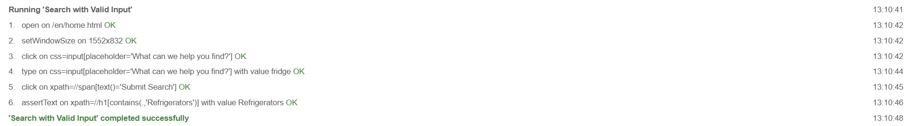

'Search With Invalid Input':
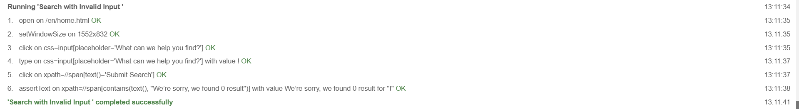

'Search with Single Filter':
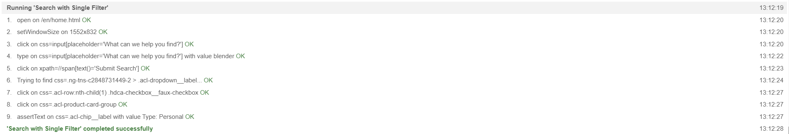

'Search with Multiple Filters':
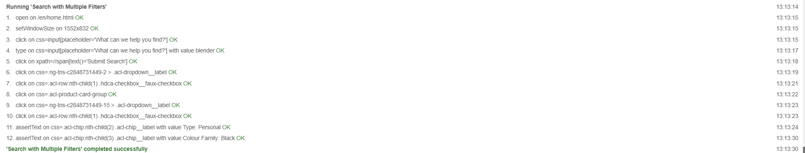

'Navigation - Forward Only':

'Navigation - Backwards and Over Multiple Pages':
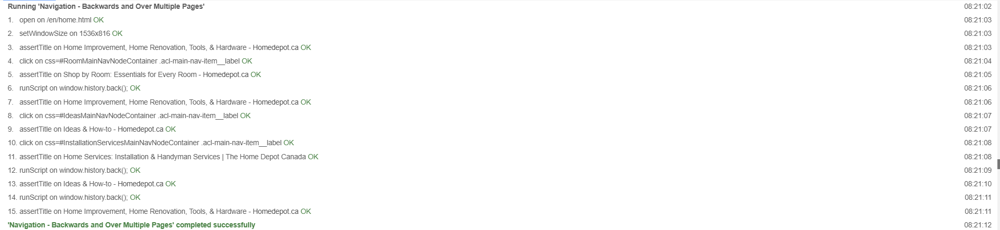

'Add Single Item to Cart':
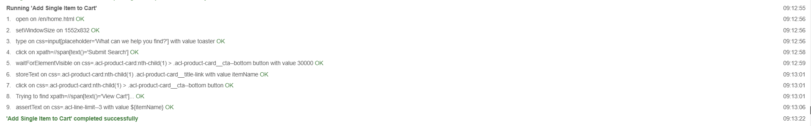

'Add Multiple Items to Cart':
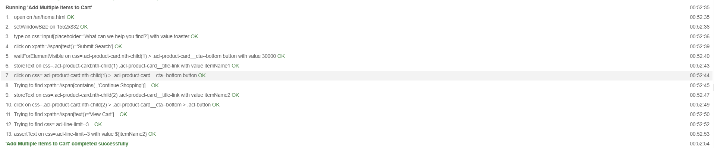

'Add and Remove Single Item from Cart':
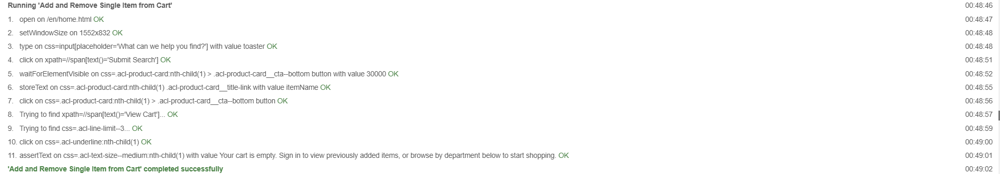

'Log in with Valid Credentials':
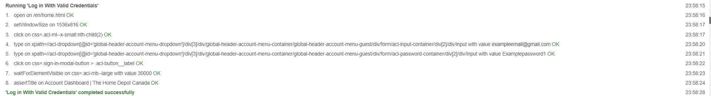

'Log In with Invalid Credentials':
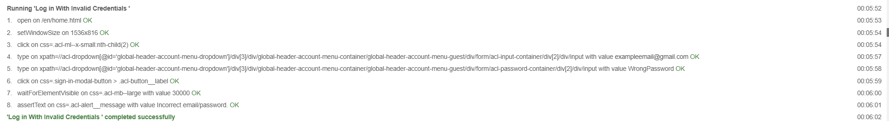

'Log In With Error Credentials':
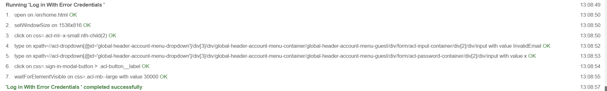

### Defects Identified During Test Automation

#### Defect 1: Login Error on Home Depot Website
- **Description**: During the automation of the login functionality (test case 3, tests under functionality 5 and 6) on the Home Depot website, the application displayed the following error message:  
  *"Sorry, an unexpected error has occurred. Please try again later."*
- **Steps to Reproduce**:
  1. Create a new account on the Home Depot website using valid credentials.
  2. Attempt to log in with the newly created account credentials.
- **Expected Behavior**: The user should be successfully logged in and redirected to their account page.
- **Actual Behavior**: The application displayed an error message, preventing the user from logging in, despite entering valid credentials.
- **Possible Cause**: This issue may be related to overuse or server-side limitations of the application. This functionality worked on this students laptop prior, and stopped working following excessive use and testing.
- **Impact**: This defect prevents users from accessing their accounts, which could hinder their ability to use the website effectively. The test for this functionality had to be tested on a different users device.